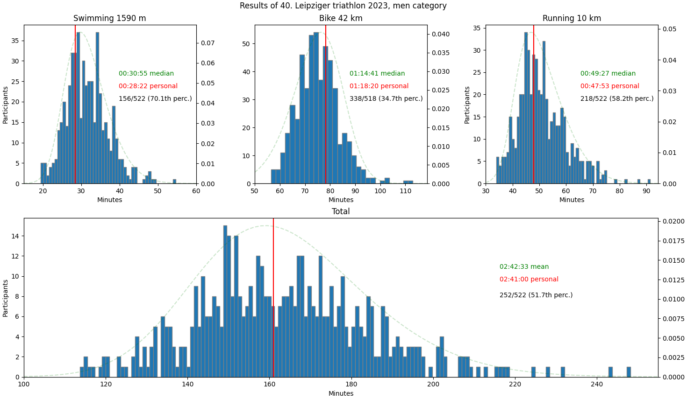

# Analysing triathlon results using web scraping

## Motivation

I took part in the competition 40. Leipziger Triathlon in 2023. The results were published in the internet. 
However, I found the table showing the rankings as well as times of individual disciplines and total time not sufficient. The numbers do not tell you much about how you stand compared to other participants - a more visual approach was needed. With diagrams, it shall be better visible which discipline is one's strength and which needs improvement. Typing manually all the entries from the webpage was not an option, so the idea of learning webscraping tools arose...

## Used techniques

- BeautifulSoup (python lib)
- Selenium web driver
- Pyplot, pandas, ...

## How it works
 
## Todo

- gaussian fit for all disciplines ✅
- results by age category
- emojis with disciplines and stopwatch
- best time, average time (also time delta to best and average)
- interactive web tool showing the results -> separate, quite big project

## Results

