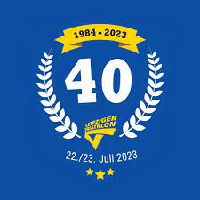
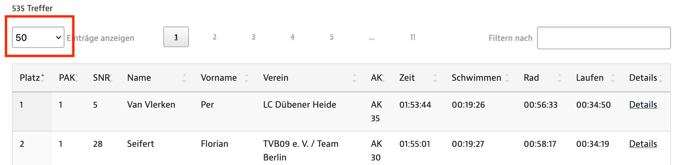

# Analysing triathlon results using web scraping

## Motivation

I took part in the competition 40. Leipziger Triathlon in 2023. The results were published in the internet. 
However, I found the table showing the rankings as well as times of individual disciplines and total time not sufficient. The numbers do not tell you much about how you stand compared to other participants - a more visual approach was needed. With diagrams, it shall be better visible which discipline is one's strength and which needs improvement. Typing manually all the entries from the webpage was not an option, so the idea of learning webscraping tools arose...

Competition results: 
https://www.leipziger-triathlon.de/ergebnisse/leipziger-triathlon/?ev=40

## Used techniques

- BeautifulSoup (python lib)
- Selenium web driver
- Pyplot, pandas, ...

## How it works

First it is needed to find out whether the table of interest is generated by JavaScript or coded statically. This can be done easily by disabling JavaScript in the browser (e.g. Chrome - inspect element, *CTRL+SHIFT+P* and enter *"Disable JavaScript"*). When the content is not visible anymore, it is generated by a script as was the case here.

Using *Selenium* webdriver, a headless browser is created and the target URL opened. After a short timeout, the webpage starts being processed. A click on the "all" button must be simulated by calling the `click` method on the dropdown list element (marked red below) and selecting the option specified by the element's name and value. After a short pause to load the results, the table is retrieved with *BeautifulSoup* using the id and the table rows sequentially parsed as child elements of the `tbody`. The individual cells marked as `td` elements are loaded into a DataFrame which is saved at the end.

</img>

Eventually the dataset is loaded, processed and plotted using `plotter.py`. First, the dataset is cleaned of a few entries of people that were either disqualified or did not finish the competition (marked as `DNF` - did not finish and `DSQ` - disqualified). The code then extracts personal times from the DataFrame, displays the whole dataset as histogram with bins of "just enough" resolution. The goal is not to have too many bins to avoid seeing only noise and not too few to be able to compare to others. A plot with bins of 60 results in a nice visualisation of the underlying normal distribution and satysfies the criteria. Finally, all the labels are set and the normal distribution calculated.

### Further examples

- `wikipedia_example.py` shows how to scrape a static website like Wikipedia
- `static_scraper.py` shows how BeautifulSoup fails when trying to parse dynamically generated JavaScript content 
- `gaussian_fit.py` demonstrates fitting with normal distribution using `norm` from `scipy.stats`

## Results

The results provide an overview of the finish times for all 3 triathlon disciplines and the total time including the changes between them. The histogram's x-axis displays the time in minutes and the y-axis the corresponding number of participants that had this finish time. In the background a gaussian fit including skew is plotted to demonstrate the distribution.  

The personal time in each discipline is now in direct comparison to the times of all other male participants. This provides a better feeling which is one's strength and what shall be worked on. For me, it was a surprise that I finished the swimming part faster than more than 70% of the sportsmen. Provided I breathed in a bit of water directly after start and got desoriented after the last buoy, therefore swimming some 100 m or more extra, it is an unexpectedly good result! The cycling part truly did not feel remarkable as many people were passing by. However, I still managed to be in the middle and also I caught up during the running phase, overtaking more than 58%. 

The tools provide the necessary information and can be re-used for other purposes in the future - such as the training for the World Triathlon 2024 in Hamburg.

## Resources

- https://www.youtube.com/watch?v=Xz514u4V_ts
- https://www.tutorialspoint.com/how-to-get-firefox-working-with-selenium-webdriver-on-mac-osx
- https://github.com/mozilla/geckodriver/releases

## Future ideas

- gaussian fit for all disciplines ✅
- results by age category
- emojis with disciplines and stopwatch
- best time, average time (also time delta to best and average)
- interactive web tool showing the results -> separate, quite big project